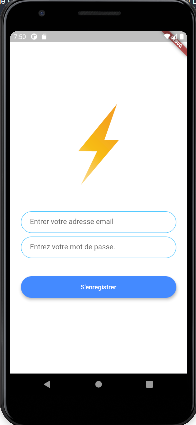

# flutter_messager

Application de messagerie moderne où les utilisateurs peuvent s'inscrire et se connecter au chat.
Utilise Firebase Cloud Firestore ainsi que le package d'authentification Firebase.

### Compatible Android ou Ios

## Screenshots

### En cours de développement
